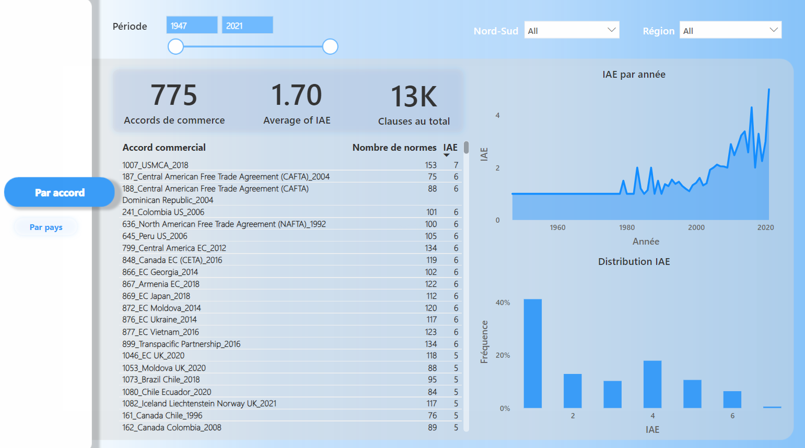
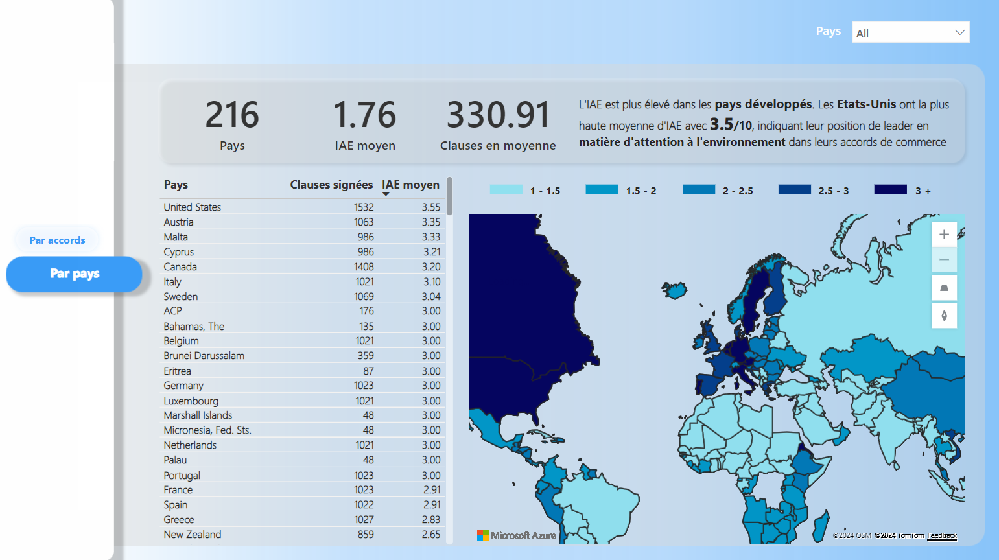

# Résultats de l'Analyse de l'Indice d'Attention portée à l’Environnement (IAE) dans les ACPr

## Interprétation des résultats

### 1. Vue d'ensemble par accords commerciaux
- **Accords totaux analysés : 775**
  - L'IAE moyen de 1.70 indique que l'environnement commence à être pris en compte dans les accords, mais reste secondaire.
  - **Augmentation de l'IAE depuis les années 1980** : Cette croissance reflète une sensibilisation accrue aux questions environnementales dans le cadre des accords commerciaux internationaux, en particulier depuis la fin des années 1980.

  

**Interprétation** : L'intégration croissante des clauses environnementales dans les ACPr est un signe de la prise de conscience mondiale des enjeux écologiques. Cette tendance, particulièrement visible dans les accords Nord-Sud, reflète les efforts des pays pour intégrer des clauses visant à harmoniser les pratiques environnementales internationales.

### 2. Vue par pays
- **216 pays et groupements de pays ont signé des accords de commerce**.
  - Les **États-Unis** se démarquent avec un IAE moyen de 3.55, suggérant une forte intégration des clauses environnementales.
  - **Différence Nord-Sud** : Les accords Nord-Sud montrent une plus grande prise en compte de l’environnement comparativement aux accords Nord-Nord ou Sud-Sud, indiquant une disparité géographique dans la façon dont les pays abordent ces enjeux.

  

**Interprétation** : Les pays développés, notamment les États-Unis et certains pays européens, montrent un engagement plus prononcé à l’égard de l’environnement dans leurs accords. En revanche, les pays en développement semblent prioriser la croissance économique, ce qui se traduit par des scores IAE plus bas. Les résultats soulignent également le rôle des facteurs comme la démocratie, la proximité géographique et les émissions de CO2 dans la formulation des clauses environnementales.

## Conclusion
L’analyse montre une intégration croissante des enjeux environnementaux dans les accords commerciaux préférentiels, avec une disparité notable entre les pays développés et en développement. Cette évolution est essentielle pour harmoniser les pratiques commerciales et promouvoir un commerce international plus respectueux de l’environnement. Cependant, l'efficacité des clauses dépend de leur mise en œuvre, ce qui ouvre la voie à des recherches futures sur leur impact réel.
