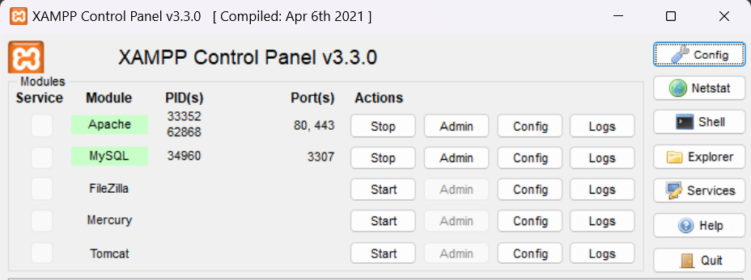

# Banking Fraud Analysis Project

## Description
This project simulates fictive banking transactions and records users' responses related to their attitude toward risk and money. The goal is to collect data from users and store it in a MySQL database to analyze potential indicators of fraudulent behavior. The application is built using HTML, CSS, JavaScript (for form validation and dynamic data), PHP (for backend processing), and MySQL (for database storage).

## Goals
- **Data Collection**: Create a form where users can enter transaction information and their attitudes towards financial risks.
- **Database Storage**: Store submitted data into a MySQL database for further analysis.
- **Risk & Fraud Analysis**: Analyze how users respond to risk-related questions to identify potential fraudulent behaviors.
- **Deployment**: Provide both local deployment using XAMPP and an external hosting solution via InfinityFree.

## Tools
- **HTML**: Used to build the frontend user interface.
- **CSS**: For styling the web form.
- **JavaScript**: 
  - For client-side validation and dynamic dropdowns for country, state, and city selection.
  - API for fetching country and city data.
- **PHP**: 
  - Backend processing and form data submission to MySQL.
  - Validation of form inputs and execution of SQL queries.
- **MySQL**: Database for storing transaction details, including user inputs from the form.
- **XAMPP**: Local development environment (Apache, PHP, MySQL) for hosting and testing the project.
- **InfinityFree**: External hosting solution for online deployment of the project.

## Steps

### 1. Setup on Local Machine (XAMPP)
Follow these steps to run the project locally using XAMPP:

#### a. Install XAMPP Control Panel
   - Download and install [XAMPP](https://www.apachefriends.org/download.html) for your operating system.
   - Ensure that Apache and MySQL services are running in the XAMPP Control Panel.
     
     

#### b. Project Files
   - Download the directory `fraud_project` and put it into the `htdocs` folder of your XAMPP installation.
   - Example location for `htdocs`: 
     ``` 
     C:\xampp\htdocs\fraud_project
     ```

#### c. Configure the Database
   - Open **phpMyAdmin** by navigating to `http://localhost/phpmyadmin/` or **MySQL**.
   - Create a new database named `fraud_db`.
   - Run the following SQL script to create the `transactions` table:

```sql
CREATE TABLE transactions(
  transaction_id INT AUTO_INCREMENT PRIMARY KEY,
  full_name VARCHAR(100),
  gender VARCHAR(25),
  country VARCHAR(50),
  state VARCHAR(50),
  city VARCHAR(50),
  category VARCHAR(100),
  amount INT,
  fraud_status BOOLEAN,
  likes_money INT,
  risk_choice VARCHAR(10),	
  date TIMESTAMP DEFAULT CURRENT_TIMESTAMP
);
```

#### d. Update Configuration Files
   - Modify the `connect.php` file to use your local MySQL credentials (hostname, username, password, database_name) :
     ```php
     $conn = new mysqli('localhost', 'root', '', 'fraud_db');
     ```
  - A PHP code named `connexion_test.php` to test the connexion to the DB is included in the `fraud_project` directory. You can run it by navigating to `http://localhost/fraud_project/connexion_test.php`.

#### e. Test the Application
   - Open your browser and go to `http://localhost/fraud_project/index.html`.
   - Submit a test form to see if data is correctly stored in the database.
   - You can view the stored data in **phpMyAdmin** or **MySQL** under the `fraud_db` database.

### 2. Deployment on InfinityFree (External Host)

You can deploy this project online using a free hosting service like [InfinityFree](https://www.infinityfree.com/). Here’s how to do it:

#### a. Register for InfinityFree
   - Sign up for an account on InfinityFree.
   - Create a new website and domain.

#### b. Create a New Database
   - Navigate to **MySQL Databases** and create a new database.
   - You will find all your connection information (database name, username, password, and host) provided in this section.

#### c. Upload Project Files
   - Use the **File Manager** to upload all project files to the `htdocs` folder of your website on InfinityFree.

#### d. Configure the Database
   - In your InfinityFree control panel, create a new MySQL database.
   - Update your `connect.php` file with the new database credentials:
     ```php
     $conn = new mysqli('HOST_NAME', 'YOUR_USERNAME', 'YOUR_ACCOUNT_PASSWORD', 'YOUR_DB_NAME');
     ```

#### e. Test the Application
   - Visit the URL of your hosted site (e.g., `http://yourdomain.infinityfree.com/fraud_project/form.html`).
   - Submit the form and check that data is correctly stored in your InfinityFree MySQL database.

For a more detailed guide on deploying projects to InfinityFree, visit their [documentation]([https://support.infinityfree.net/getting-started/](https://forum.infinityfree.com/)).

#### Deployed Version
Here is the link to the deployed version of the form : [Banking Fraud Analysis - Deployed](http://auradev.infinityfreeapp.com/fraud_project/index.html)

### Files included in this project (`fraud_project`)
- `index.html`: All frontend code for user interaction.
- `app.js`: For form validation and dynamic data.
- `connect.php`: Backend processing logic, but ensure no sensitive info is exposed.
- `database.sql`: A file containing the SQL code needed to create your database and tables.


Feel free to share any suggestions or improvements for this project by reaching out to me, or by submitting a pull request or a fork. Thank you and happy exploring !
